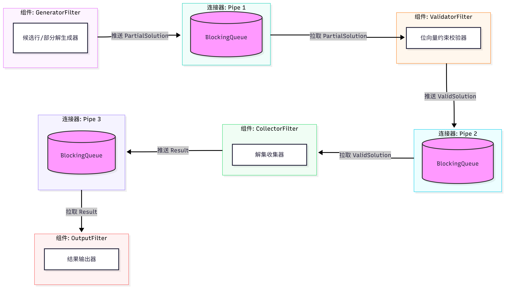

# 架构一：管道-过滤器（Pipes and Filters）

> 责任人：成员A（组长）　包路径：`edu.scut.nqueens.pipesfilter`　对应阶段1 C&C 图：[docs/cnc-pipes-filter.png](docs/cnc-pipes-filter.png)

---

## 一、风格说明

把 N 皇后求解过程组织成一条**单向数据流**：每个过滤器只做一件事，只通过管道与相邻过滤器通信，
**不共享可变状态、不互相调用**。

用这种风格解 N 皇后的关键点是：把"逐行扩展"这个天然带有递归/回溯味道的过程，
改造成"数据在链条上流动、被不断扩展与剪枝"的过程——部分解从上游流下来，
校验过滤器把它扩展成下一行的若干个合法子部分解，解集收集过滤器只负责收集完整解。
整条链没有反馈回路，解的数量与正确性完全由数据流的语义决定。

## 二、组件-连接器图（阶段1 所画）

```mermaid
graph LR
    subgraph Component_Filter1 [组件: GeneratorFilter]
        F1[候选行/部分解生成器]
    end

    subgraph Connector_Pipe1 [连接器: Pipe 1]
        P1[(BlockingQueue<PartialSolution>)]
    end

    subgraph Component_Filter2 [组件: ValidatorFilter]
        F2[位向量约束校验器]
    end

    subgraph Connector_Pipe2 [连接器: Pipe 2]
        P2[(BlockingQueue<ValidSolution>)]
    end

    subgraph Component_Filter3 [组件: CollectorFilter]
        F3[解集收集器]
    end

    subgraph Connector_Pipe3 [连接器: Pipe 3]
        P3[(BlockingQueue<Result>)]
    end

    subgraph Component_Filter4 [组件: OutputFilter]
        F4[结果输出器]
    end

    F1 -->|推送 PartialSolution| P1
    P1 -->|拉取 PartialSolution| F2
    F2 -->|推送 ValidSolution| P2
    P2 -->|拉取 ValidSolution| F3
    F3 -->|推送 Result| P3
    P3 -->|拉取 Result| F4

    style P1 fill:#f9f,stroke:#333,stroke-width:2px
    style P2 fill:#f9f,stroke:#333,stroke-width:2px
    style P3 fill:#f9f,stroke:#333,stroke-width:2px
```





## 三、组件与连接器清单（图 ↔ 代码对照）

| 图中组件 | 职责 | 代码 |
|---|---|---|
| GeneratorFilter（候选行/部分解生成器） | 数据源：产生第 0 行的 N 个候选部分解，不做剪枝 | `GeneratorFilter.java` |
| ValidatorFilter（位向量约束校验器） | 逐行扩展 + 位向量剪枝，把合法子部分解写向下游 | `ValidatorFilter.java` |
| CollectorFilter（解集收集器） | 判定完整解、编号、计数，包装成 Result | `CollectorFilter.java` |
| OutputFilter（结果输出器） | 数据汇：格式化输出（控制台 / 日志文件） | `OutputFilter.java` |

| 图中连接器 | 承载类型 | 代码 |
|---|---|---|
| Pipe 1 | `PartialSolution` | `Pipe<PartialSolution>`，容量 64 |
| Pipe 2 | `ValidSolution` | `Pipe<ValidSolution>` |
| Pipe 3 | `Result` | `Pipe<Result>` |

过滤器基类与装配入口：`Filter.java`（含 final 的主循环）、`PipeFilterMain.java`（装配与启动）。

## 四、两条容易做错的地方

**1. 流什么时候结束？** 过滤器无法预知上游是否还会产出数据，必须显式传递**流结束标记（EOS）**：
读到 EOS 的过滤器先把它转发给下游，再结束自己的线程，EOS 沿管道链一路传播。
漏掉这一步的典型症状是程序跑完之后线程不退出、`join` 永远等下去。

**2. 为什么校验和扩展在同一个过滤器里？**
纯管道-过滤器没有反馈回路，部分解只能单向流动。若把"校验"与"扩展"拆成两个过滤器，
合法部分解在链条上每前进一格只能多放一行，数据量成倍膨胀却毫无意义。
把"枚举下一行的 N 个列 + 位向量剪枝"合并进 ValidatorFilter，一次处理就能把
1 个部分解扩展成若干个合法子部分解，扇出一棵搜索树——这是本架构的**关键设计决策**，
也是答辩时会被追问的点，请按上面的理由回答。

## 五、架构约束自查表（提交前逐项确认）

| # | 约束 | 是/否 | 说明 / 证据（写在何处能看出来） |
|---|---|---|---|
| 1 | 过滤器之间只通过管道通信，没有直接调用 | | `Filter` 基类只持有 in/out 两个管道引用 |
| 2 | 不存在全局共享可变状态 | | 无 static 可变字段；共享对象均为不可变 |
| 3 | 不使用共享内存（无共享数组/集合被多过滤器同时读写） | | 管道内数据 take 后即离开共享区 |
| 4 | 过滤器的状态是私有且只增不减的 | | `CollectorFilter.collectedCount` 为本线程私有计数 |
| 5 | 源过滤器不读上游、汇过滤器不写下游 | | `GeneratorFilter.in == null`、`OutputFilter.out == null` |
| 6 | 数据流方向单一，无反馈回路 | | 图与代码均为线性链 Pipe1→Pipe2→Pipe3 |
| 7 | 剪枝调用全组统一实现 | | `ValidatorFilter` 注入 `common.BitVectorPruner` |

## 六、待办清单（TODO）

| 文件 | 待实现 |
|---|---|
| `common/BitVectorPrunerImpl.java` | `initial` / `canPlace` / `place`（**五种架构共用，先做这个**） |
| `pipesfilter/Pipe.java` | `put` / `take` / `close`（EOS 标记） |
| `pipesfilter/Filter.java` | `run()` 主循环（含 EOS 转发与源过滤器的单次执行） |
| `pipesfilter/GeneratorFilter.java` | `process`：写出第 0 行候选 |
| `pipesfilter/ValidatorFilter.java` | `process`：扩展 + 剪枝，包装 ValidSolution |
| `pipesfilter/CollectorFilter.java` | `process`：判定完整解、编号成 Result、计数 |
| `pipesfilter/OutputFilter.java` | `process`：输出格式（含可选棋盘图） |
| `pipesfilter/PipeFilterMain.java` | `run`：装配管道与过滤器、启动线程、join、汇总日志 |
| `test/.../BitVectorPrunerTest.java` | 去掉 `@Disabled` 并补全用例 |

## 七、运行与验证

```bash
# 求全部解（N=8 应为 92 个解）
mvn exec:java "-Dexec.args=--arch=pipes --n=8"

# 只求第一个解
mvn exec:java "-Dexec.args=--arch=pipes --n=12 --first"
```

验收标准：N=8 输出 92 个解且程序正常退出（无残留线程）；N=8/10/12 结果与其它架构一致。

## 八、实验记录（阶段3 采集，原始日志另存）

运行环境（固定记录一次）：OS ______ / CPU ______ / 内存 ______ / JDK ______ / Maven ______

| N | 完整命令 | 解数 | 耗时(ms) | 备注 |
|---|---|---|---|---|
| 8 | | | | |
| 10 | | | | |
| 12 | | | | |
