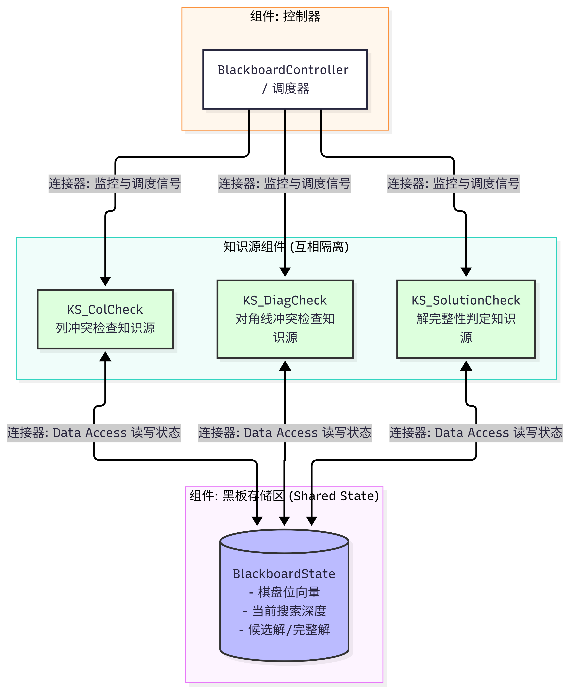

# 架构二：黑板（Blackboard）

> 责任人：成员B　包路径：`edu.scut.nqueens.blackboard`　对应阶段1 C&C 图：[docs/cnc-blackboard.png](docs/cnc-blackboard.png)

---

## 一、风格说明

黑板的思路是"**共享状态 + 独立规则 + 调度器**"：没有固定的数据流，也没有固定的调用链，
而是把问题求解的全部信息放在一块共享的黑板上，由多个彼此互不知情的知识源
各自读黑板、判断自己能不能出手、出手就把结论写回黑板，直到黑板不再变化为止。

**三要素缺一不可**（作业评分点，每种架构 7 分）：

| 要素 | 在本工程中的体现 | 代码 |
|---|---|---|
| 黑板存储区（共享状态） | 棋盘位向量 + 当前搜索深度 + 候选解/完整解 | `BlackboardState.java` |
| 多个相互独立的知识源 | KS_ColCheck / KS_DiagCheck / KS_SolutionCheck | `KS_*.java` |
| 控制器（调度） | 决定每个知识源何时触发、何时停机 | `BlackboardController.java` |

**知识源之间绝对无直接通信**这条约束不是靠自觉，而是结构上写不出来：
`KnowledgeSource` 接口的两个方法只接受 `BlackboardState`，知识源拿不到彼此的任何引用。

## 二、组件-连接器图（阶段1 所画）



```mermaid
graph TD
    subgraph BlackboardStorage [组件: 黑板存储区 (Shared State)]
        BB[(BlackboardState\n- 棋盘位向量\n- 当前搜索深度\n- 候选解/完整解)]
    end

    subgraph KnowledgeSources [知识源组件 (互相隔离)]
        KS1[KS_ColCheck\n列冲突检查知识源]
        KS2[KS_DiagCheck\n对角线冲突检查知识源]
        KS3[KS_SolutionCheck\n解完整性判定知识源]
    end

    subgraph BlackboardController [组件: 控制器]
        Ctrl[BlackboardController / 调度器]
    end

    %% 连接器定义
    Ctrl -->|连接器: 监控与调度信号| KS1
    Ctrl -->|连接器: 监控与调度信号| KS2
    Ctrl -->|连接器: 监控与调度信号| KS3

    KS1 <-->|连接器: Data Access 读写状态| BB
    KS2 <-->|连接器: Data Access 读写状态| BB
    KS3 <-->|连接器: Data Access 读写状态| BB

    style BB fill:#bbf,stroke:#333,stroke-width:2px
    style KS1 fill:#dfd,stroke:#333
    style KS2 fill:#dfd,stroke:#333
    style KS3 fill:#dfd,stroke:#333
```

## 三、组件清单（图 ↔ 代码对照）

| 图中组件 | 职责 | 代码 |
|---|---|---|
| 黑板存储区 (Shared State) | 全系统唯一的共享状态；知识源通过它间接交互 | `BlackboardState.java` |
| KS_ColCheck（列冲突检查知识源） | 只判"列是否重复"这一条规则 | `KS_ColCheck.java` |
| KS_DiagCheck（对角线冲突检查知识源） | 只判"两条对角线是否重复"这一条规则 | `KS_DiagCheck.java` |
| KS_SolutionCheck（解完整性判定知识源） | 只判"是否已放满 N 行并收集解" | `KS_SolutionCheck.java` |
| 控制器 / 调度器 | 调度触发顺序、判定停机、不含任何求解规则 | `BlackboardController.java` |

| 图中连接器 | 含义 | 代码体现 |
|---|---|---|
| 监控与调度信号 | 控制器 → 知识源（单向） | 控制器持有 `List<KnowledgeSource>` 并调用其 `canHandle` / `execute` |
| Data Access 读写状态 | 知识源 ↔ 黑板（双向） | `KnowledgeSource` 接口参数为 `BlackboardState` |

## 四、需要你们先定下来的三件事（答辩核心）

> 这三条决定了黑板的"求解形态"，请在实现前讨论清楚并把结论写进本节，代码与图才能对得上。

**1. 黑板上到底存"一条路径"还是"一堆候选"？**
C&C 图上既画了"当前搜索深度"，又画了"候选解/完整解"。两种理解都可能是合理的黑板实现：
只保存一条当前路径（深度 + 位向量）→ 更像"黑板上的深度优先搜索"；
保存候选解集合 → 更像"对一批候选批量施加规则"。
本骨架两类字段都保留了，**实现时请删掉用不到的那些**，保持"黑板上只有真正需要共享的东西"。

**2. 谁来负责"扩展下一行"？**
图中有三个知识源，它们分别只管列冲突、对角线冲突、解判定，**没有一个是"行扩展"知识源**。
那么"把部分解往下放一行"这件事由谁做？常见做法有两种：
控制器在推进搜索时生成候选并放上黑板；或由某个知识源在通过全部检查后负责推进深度。
这直接决定了控制器是"纯调度器"还是"还干活的调度器"，是本架构最值得在报告里讲清楚的设计决策。

**3. 停机条件是什么？**
黑板架构没有天然结束信号。推荐用**版本号收敛**判定：
一轮下来所有知识源都不可触发，且 `revision()` 相比本轮开始时没有增长 → 到达稳定态，停机。
只判断"知识源都不可触发"是不够的，容易提前停机导致漏解（N=8 应当恰好 92 个解，可用于自检）。

## 五、架构约束自查表（提交前逐项确认）

| # | 约束 | 是/否 | 说明 / 证据 |
|---|---|---|---|
| 1 | 具备黑板存储区（共享状态区） | | `BlackboardState` 是唯一共享对象 |
| 2 | 具备多个相互独立的知识源 | | 三个 KS 各自只实现一条规则 |
| 3 | 具备控制器，且负责调度触发顺序 | | `BlackboardController.solve()` |
| 4 | **知识源之间无任何直接通信**（不互相持有引用/调用） | | 接口方法只收 `BlackboardState` |
| 5 | 知识源不通过黑板反向持有彼此 | | `BlackboardState` 不持有 KS 引用 |
| 6 | 控制器是唯一持有知识源集合的组件 | | `List<KnowledgeSource>` 仅存在于控制器与装配器 |
| 7 | 知识源可独立替换而不影响其它知识源 | | 三个 KS 之间零依赖 |
| 8 | 剪枝调用全组统一实现 | | KS_ColCheck / KS_DiagCheck 注入 `common.BitVectorPruner` |
| 9 | 黑板内容变更都递增版本号（供控制器判断进展） | | `publish*/updateBoardState/setDepth` 内 `revision++` |

## 六、待办清单（TODO）

| 文件 | 待实现 |
|---|---|
| `common/BitVectorPrunerImpl.java` | `initial` / `canPlace` / `place`（**五种架构共用，先做这个**） |
| `blackboard/BlackboardState.java` | `updateBoardState` / `setDepth` / `publishCandidate` / `takeCandidate` / `publishSolution` / `markFinished` |
| `blackboard/KS_ColCheck.java` | `canHandle` / `execute` |
| `blackboard/KS_DiagCheck.java` | `canHandle` / `execute` |
| `blackboard/KS_SolutionCheck.java` | `canHandle` / `execute` |
| `blackboard/BlackboardController.java` | `solve()` 调度循环与停机判定 |
| `blackboard/BlackboardMain.java` | `run`：装配黑板 + 三知识源 + 控制器，汇总日志 |

## 七、运行与验证

```bash
# 求全部解（N=8 应为 92 个解）
mvn exec:java "-Dexec.args=--arch=blackboard --n=8"

# 只求第一个解
mvn exec:java "-Dexec.args=--arch=blackboard --n=12 --first"
```

验收标准：N=8 输出 92 个解；与管道-过滤器架构的解集合**逐一相同**（可写一个对比测试验证）。

## 八、实验记录（阶段3 采集，原始日志另存）

运行环境（固定记录一次）：OS ______ / CPU ______ / 内存 ______ / JDK ______ / Maven ______

| N | 完整命令 | 解数 | 耗时(ms) | 备注 |
|---|---|---|---|---|
| 8 | | | | |
| 10 | | | | |
| 12 | | | | |

---

## 附：为什么这条架构"看起来简单、写起来容易跑偏"

黑板最容易被写成"伪黑板"的两种方式：
① 把整个求解算法塞进一个知识源，其余知识源只是摆设；
② 让知识源之间互相调用（"检查完列再让对角线检查一下"），变成一条隐式的调用链。
判断标准很简单：**把任意一个知识源删掉，其余知识源应当照常运行**（只是结果不同或漏解），
而不是编译不过或抛异常。请在提交前用这个标准自查一遍。
